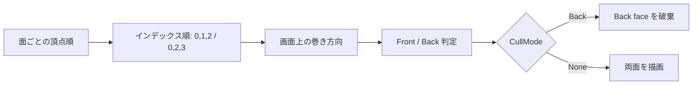
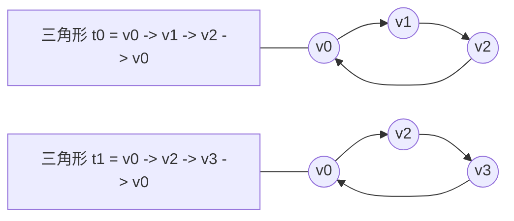

# Box の頂点巻き順と Back-Face Culling (Slang + D3D12)

このメモは、Box が裏返って見えた原因、実施した修正、確認手順をまとめたものです。

## 症状

- カメラは Box の外側にある。
- それでも Box の内側が見えているように見える。

## 原因

面の表示・非表示は次の 2 つで決まります。

1. 三角形の巻き順 (インデックス順)
2. ラスタライザのカリング設定

巻き順と Front face 判定の規約が一致していないと、外側の面が Back face と判定されます。

## このプロジェクトでの主要設定

- 各 quad のインデックスを次に統一
  - 0, 1, 2
  - 0, 2, 3
- 各面の頂点 4 点は、上のインデックスで正しい面向きになる順に並べる
- パイプライン作成時に Back-face culling を有効化
  - desc.rasterizer.cullMode = rhi::CullMode::Back;

## 判定フロー

## 面構築ルール

各面 (4 頂点) を次の規則で並べます。

- v0: 基準コーナー
- v1: v0 から 1 辺進んだコーナー
- v2: 対角コーナー
- v3: 残りのコーナー

三角形は次の 2 つで構成します。

- t0 = (v0, v1, v2)
- t1 = (v0, v2, v3)

2つの三角形は対角線 v0-v2 を共有し、合わせて 1 つの quad になります。

この形に統一すると、面ごとのインデックス例外が不要になります。

## デバッグ手順

メッシュが裏返って見えるときは次を確認します。

1. 一時的に CullMode::None にする。
2. 形が出るなら、巻き順と Front/Back 規約の不一致の可能性が高い。
3. CullMode::Back に戻す。
4. 面ごとに頂点順またはインデックス順を修正する。

## なぜ CullMode::Back を使うか

特定の視点では見た目が同じでも、CullMode::Back は有効にしておくのが基本です。

- 巻き順の不整合を早く発見できる
- オーバードローを減らせる
- 不透明描画の一般的な設定に一致する

## 参照箇所

- 頂点・インデックスデータ
  - src/app_main/slang_renderer_box.cpp
- カリング設定
  - src/app_main/slang_helper.cpp