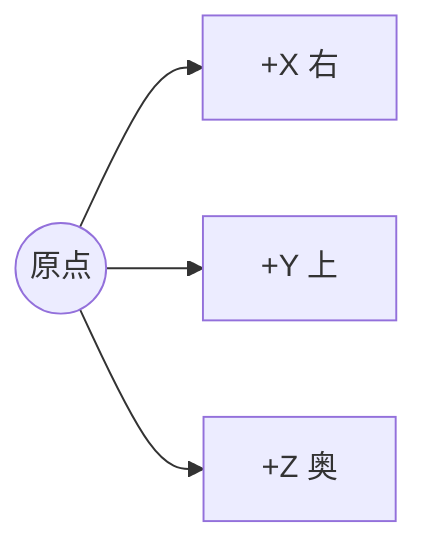
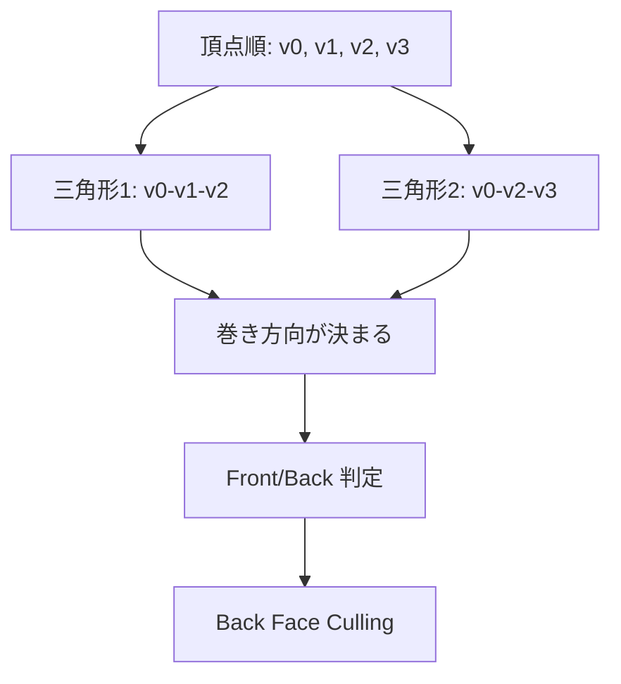

# 左手座標系での面向き早見表

このドキュメントは、Box メッシュで面の表裏が崩れないようにするための最小限の確認ポイントをまとめたものです。

## 前提

- 座標系: 左手座標系 (DirectX 系)
- 各面は 4 頂点で構成
- インデックスは各面で固定パターン
  - 0, 1, 2
  - 0, 2, 3

## 軸の向き

## 各面の期待外向き法線

| 面 | 位置 | 期待される外向き法線 |
|---|---|---|
| Front | z = -half_depth | (0, 0, -1) |
| Back | z = +half_depth | (0, 0, +1) |
| Top | y = +half_height | (0, +1, 0) |
| Bottom | y = -half_height | (0, -1, 0) |
| Left | x = -half_width | (-1, 0, 0) |
| Right | x = +half_width | (+1, 0, 0) |

## 面ごとの頂点並びルール

各面の 4 頂点を、同じ規則で並べます。

1. v0: 基準コーナー
2. v1: v0 から 1 辺進んだコーナー
3. v2: 対角のコーナー
4. v3: 残りのコーナー

この順序にしておくと、インデックスを全 face 共通で扱えます。

## 実コード対応表 (頂点番号 0-23)

以下は src/app_main/slang_renderer_box.cpp の現在実装に対応する、面ごとの v0-v3 です。

### Front (z = -half_depth, 黄色)

| ローカル | グローバル番号 | 座標 |
|---|---:|---|
| v0 | 0 | (-half_width, -half_height, -half_depth) |
| v1 | 1 | (+half_width, -half_height, -half_depth) |
| v2 | 2 | (+half_width, +half_height, -half_depth) |
| v3 | 3 | (-half_width, +half_height, -half_depth) |

### Back (z = +half_depth, 青)

| ローカル | グローバル番号 | 座標 |
|---|---:|---|
| v0 | 4 | (-half_width, -half_height, +half_depth) |
| v1 | 5 | (-half_width, +half_height, +half_depth) |
| v2 | 6 | (+half_width, +half_height, +half_depth) |
| v3 | 7 | (+half_width, -half_height, +half_depth) |

### Top (y = +half_height, 緑)

| ローカル | グローバル番号 | 座標 |
|---|---:|---|
| v0 | 8 | (-half_width, +half_height, -half_depth) |
| v1 | 9 | (+half_width, +half_height, -half_depth) |
| v2 | 10 | (+half_width, +half_height, +half_depth) |
| v3 | 11 | (-half_width, +half_height, +half_depth) |

### Bottom (y = -half_height, シアン)

| ローカル | グローバル番号 | 座標 |
|---|---:|---|
| v0 | 12 | (-half_width, -half_height, -half_depth) |
| v1 | 13 | (-half_width, -half_height, +half_depth) |
| v2 | 14 | (+half_width, -half_height, +half_depth) |
| v3 | 15 | (+half_width, -half_height, -half_depth) |

### Left (x = -half_width, マゼンタ)

| ローカル | グローバル番号 | 座標 |
|---|---:|---|
| v0 | 16 | (-half_width, -half_height, +half_depth) |
| v1 | 17 | (-half_width, -half_height, -half_depth) |
| v2 | 18 | (-half_width, +half_height, -half_depth) |
| v3 | 19 | (-half_width, +half_height, +half_depth) |

### Right (x = +half_width, 赤)

| ローカル | グローバル番号 | 座標 |
|---|---:|---|
| v0 | 20 | (+half_width, -half_height, -half_depth) |
| v1 | 21 | (+half_width, -half_height, +half_depth) |
| v2 | 22 | (+half_width, +half_height, +half_depth) |
| v3 | 23 | (+half_width, +half_height, -half_depth) |

上の表を使えば、各面でインデックス 0, 1, 2 / 0, 2, 3 が意図どおりの面向きになっているかを確認できます。

## 1 面の作り方 (概念)

## 実装時の確認手順

1. まず Cull を None にして形状が出るか確認する。
2. 面の色分けで、どの面が反転しているかを特定する。
3. 反転面だけ「頂点 4 つの並び」を修正する。
4. Cull を Back に戻して最終確認する。

## このリポジトリで見る場所

- Box の頂点とインデックス:
  - src/app_main/slang_renderer_box.cpp
- カリング設定:
  - src/app_main/slang_helper.cpp