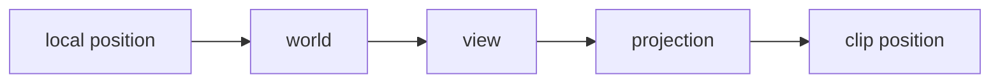
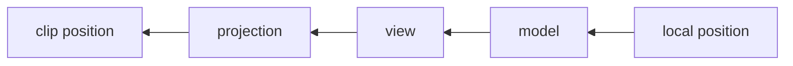

# シェーダーの行列演算順序メモ (DirectX / OpenGL / Slang)

このドキュメントは、行列演算で混乱しやすい次の 3 点を整理します。

- どちら側からベクトルを掛けるか
- 行列をどの順序で合成するか
- 行優先/列優先 (row-major/column-major) は何に効くか

## まず結論

- DirectX + HLSL でよく使う書き方
  - `mul(position, mvp)`
  - `mvp = world * view * proj`
- OpenGL + GLSL でよく使う書き方
  - `gl_Position = mvp * position`
  - `mvp = proj * view * model`

上の 2 つは見た目が逆ですが、ベクトルの置き方 (行ベクトル/列ベクトル) が違うだけで、同じ変換を表せます。

## 用語の整理

### 1) ベクトルの置き方 (演算の流儀)

- 行ベクトル流儀
  - ベクトルを左に置く: `v * M`
  - 変換は左から右へ適用される
- 列ベクトル流儀
  - ベクトルを右に置く: `M * v`
  - 変換は右から左へ適用される

### 2) row-major / column-major

これは主に「メモリにどう並ぶか」の話です。

- row-major: 行単位で並ぶ
- column-major: 列単位で並ぶ

重要: これは演算式そのもの (掛ける順序) とは別の概念です。

## DirectX (HLSL) の考え方

HLSL の `mul(a, b)` は引数順どおりの行列積を表します。よくある実装は次です。

- `float4 p = mul(float4(pos, 1.0), mvp);`
- `float4x4 mvp = mul(world, mul(view, proj));`

この場合は「行ベクトル流儀」なので、ワールド -> ビュー -> 射影の順で適用されます。

## OpenGL (GLSL) の考え方

GLSL では列ベクトル流儀が一般的です。

- `gl_Position = mvp * vec4(pos, 1.0);`
- `mvp = proj * view * model;`

式の見た目は逆ですが、意味としては同じく model -> view -> projection を適用します。

## Slang の考え方

Slang は HLSL/GLSL スタイルのコードを扱えるため、使っているシェーダー記法に合わせて考えるのが安全です。

- 今回のプロジェクトは HLSL 風 (`mul(...)`) を使っている
- そのため `mul(position, mvp)` + `mvp = world * view * proj` の組み合わせで統一する

実コード:

- `src/app_main/shader/box.slang`

## なぜ混乱が起きるか

次の 2 つを同時に混同しやすいためです。

1. ベクトルを左に置くか右に置くか
2. 行列がメモリ上で row-major か column-major か

「式の向き」と「メモリ配置」は別です。式を先に固定し、次にデータ受け渡し時のレイアウトを合わせると事故が減ります。

## 実装ガイド (このリポジトリ向け)

1. シェーダー側は `mul(position, mvp)` を使う。
2. 合成行列は `world * view * proj` で作る。
3. C++ 側で渡す行列の定義を途中で流儀変更しない。
4. 不安なときは単体テストとして次を確認する。
   - 平行移動だけ
   - 回転だけ
   - 射影だけ

## よくある不具合と症状

- 行列順序ミス
  - オブジェクトが見えない
  - 極端に歪む
- 行列転置の扱いミス
  - 軸方向が入れ替わる
  - 回転方向が想定と逆になる

## 参照

- シェーダー行列演算
  - src/app_main/shader/box.slang
- ビュー/射影行列の作成
  - src/app_main/slang_renderer_main.cpp