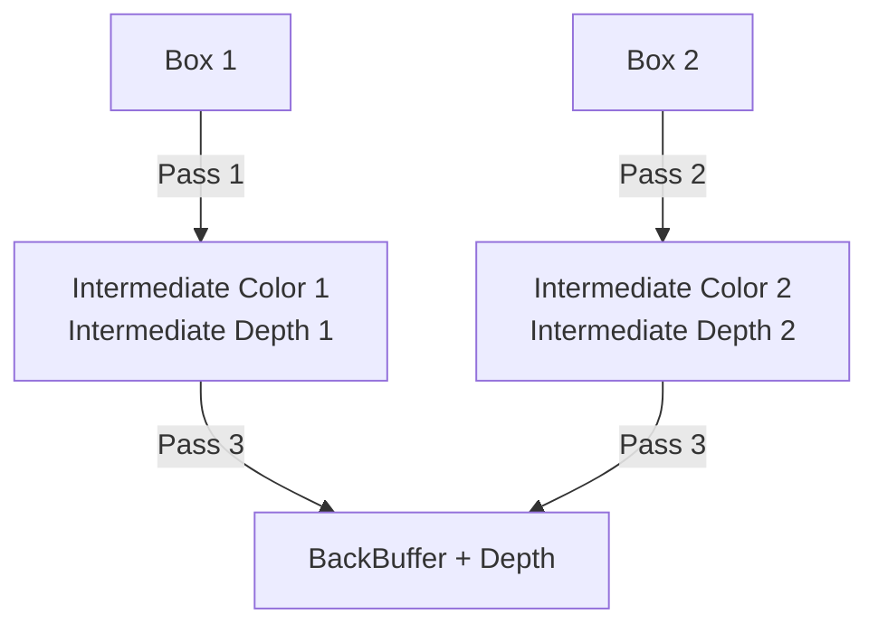

# 中間テクスチャ合成パイプライン (Slang + D3D12)

このドキュメントは、複数の Box を個別の中間テクスチャに描画してから BackBuffer に合成する
3 パス構成の実装方法と、実装中に遭遇した落とし穴をまとめたものです。

## 概要

`is_texture_composition_ == true` のモードでは次の 3 パスで描画します。



- **Pass 1 / 2**: 各 Box を専用の中間 Color + Depth テクスチャに描画
- **Pass 3**: 2 枚の中間テクスチャを深度テストしながら BackBuffer に合成

## 必要なリソース

| リソース | フォーマット | Usage フラグ |
|---|---|---|
| Intermediate Color 1 / 2 | `GetSurfaceFormat()` | `RenderTarget \| ShaderResource` |
| Intermediate Depth 1 / 2 | `D32Float` | `DepthStencil \| ShaderResource` |
| Depth (BackBuffer 用) | `D32Float` | `DepthStencil` |

---

## 落とし穴 1: カラーテクスチャのフォーマット不一致

### 症状

```
ID3D12CommandList::DrawIndexedInstanced:
The render target format in slot 0 does not match that specified by the current pipeline state.
(pipeline state = R8G8B8A8_UNORM_SRGB, render target format = R8G8B8A8_UNORM)
```

### 原因

パイプラインの `ColorTargetDesc.format` は `GetSurfaceFormat()` (SRGB など) で作成されますが、
中間テクスチャを `RGBA8Unorm` でハードコードすると不一致が起きます。

### 修正

中間 Color テクスチャのフォーマットも `GetSurfaceFormat()` から取得します。

```cpp
// NG: ハードコード
desc.format = rhi::Format::RGBA8Unorm;

// OK: Surface フォーマットに合わせる
desc.format = context_->GetSurfaceFormat();
```

---

## 落とし穴 2: パイプラインの Depth フォーマット未指定

### 症状

```
ID3D12CommandList::DrawIndexedInstanced:
The depth stencil format does not match that specified by the current pipeline state.
A null view must be bound when the pipeline state depth stencil format is UNKNOWN.
```

### 原因

`RenderPipelineDesc` の `depthStencil.format` はデフォルトで `Format::Undefined` です。
`depthTestEnable = true` と設定しても、フォーマットが未定義だと D3D12 は DSV を期待しません。

### 修正

パイプライン作成時に Depth フォーマットを明示します。

```cpp
desc.depthStencil.format = rhi::Format::D32Float;
desc.depthStencil.depthTestEnable = true;
desc.depthStencil.depthWriteEnable = true;
```

---

## 落とし穴 3: リソースステート遷移の欠落

### 症状

D3D12 エラーは出ないが、合成結果が黒画面になる。

### 原因

Pass 1 / 2 で `RenderTarget` / `DepthWrite` 状態のまま Pass 3 でシェーダーリソースとして読もうとしても、
バリアがないとドライバが古いデータを返すか、レイヤーが警告なく無視することがあります。

### 修正

Pass 2 と Pass 3 の間にステート遷移とバリアを挿入します。

```cpp
// Pass 1 / 2 完了後: シェーダーで読める状態に遷移
encoder->setTextureState(color1, rhi::ResourceState::ShaderResource);
encoder->setTextureState(depth1, rhi::ResourceState::DepthRead);
encoder->setTextureState(color2, rhi::ResourceState::ShaderResource);
encoder->setTextureState(depth2, rhi::ResourceState::DepthRead);
encoder->globalBarrier();

// Pass 3: 合成描画 ...

// Pass 3 完了後: 次フレームのために元の状態に戻す
encoder->setTextureState(color1, rhi::ResourceState::RenderTarget);
encoder->setTextureState(depth1, rhi::ResourceState::DepthWrite);
encoder->setTextureState(color2, rhi::ResourceState::RenderTarget);
encoder->setTextureState(depth2, rhi::ResourceState::DepthWrite);
encoder->globalBarrier();
```

`setTextureState` + `globalBarrier` の組み合わせで確実にバリアを発行します。

---

## 落とし穴 4: Depth テクスチャのサンプリング型

### 症状

Slang コンパイルエラー:

```
expected an expression of type 'float', got 'vector<float,4>'
```

### 原因

型なし `Texture2D` は `.Sample()` が `float4` を返しますが、`SV_Depth` への出力は `float` を要求します。

### 修正

Depth テクスチャは `Texture2D<float>` で宣言します。

```hlsl
// NG
Texture2D src_depth_texture;

// OK
Texture2D<float> src_depth_texture;
```

---

## 落とし穴 5: フルスクリーンクアッドの巻き順

### 症状

D3D12 エラーも Slang エラーもないが、合成後の画面が黒のまま。

### 原因

D3D12 のスクリーン空間は Y 軸が下向きです。
インデックス `{0,1,2}` = TL→TR→BL は **時計回り (CW) = Back face** となり、
Back-face Culling が有効なのですべての三角形が破棄されます。

### 修正

`{0,2,1, 1,2,3}` にして **反時計回り (CCW) = Front face** にします。

```cpp
// NG: スクリーン空間では CW = Back face
std::vector<uint32_t> indices = { 0, 1, 2, 1, 3, 2 };

// OK: スクリーン空間では CCW = Front face
std::vector<uint32_t> indices = { 0, 2, 1, 1, 2, 3 };
```

詳細は [box-winding-and-culling.md](box-winding-and-culling.md) のスクリーン空間クアッドの節を参照してください。

---

## 合成シェーダー (draw_texture.slang)

Pass 3 ではフルスクリーンクアッドに中間テクスチャをサンプリングし、Color と Depth を同時に出力します。

```hlsl
cbuffer Uniforms
{
    float4x4 wvp_matrix;
    Texture2D src_color_texture;
    Texture2D<float> src_depth_texture;  // 型指定必須
    SamplerState sampler;
}

struct FSOut
{
    float4 color : SV_Target;
    float depth  : SV_Depth;  // Depth を書き戻す
};

[shader("fragment")]
FSOut fs_main(float2 uv: UV)
{
    FSOut output;
    output.color = src_color_texture.Sample(sampler, uv);
    output.depth = src_depth_texture.Sample(sampler, uv);
    return output;
}
```

`SV_Depth` に中間 Depth をそのまま書き戻すことで、BackBuffer の深度バッファと正しく比較されます。

---

## デバッグ手順

1. **D3D12 エラーを確認する**
   - フォーマット不一致 → 中間テクスチャのフォーマット確認
   - `pipeline state = UNKNOWN` の DSV エラー → `depthStencil.format` 設定確認
2. **エラーがないが黒画面**
   - Pass 2 → Pass 3 のバリア挿入を確認
   - フルスクリーンクアッドが描画されているか確認（CullMode::None で一時テスト）
3. **描画されるが前後関係がおかしい**
   - `DepthFunc` が `Less` / `Greater` の向きを確認
   - Reverse-Z を使っている場合は `Greater` が正しい

## 参照箇所

| 内容 | ファイル |
|---|---|
| 3 パス描画ロジック | src/app_main/slang_renderer_main.cpp |
| フルスクリーンクアッド描画 | src/app_main/slang_renderer_texture.cpp |
| 合成シェーダー | src/app_main/shader/draw_texture.slang |
| パイプライン作成 (format 設定含む) | src/app_main/slang_helper.cpp |
